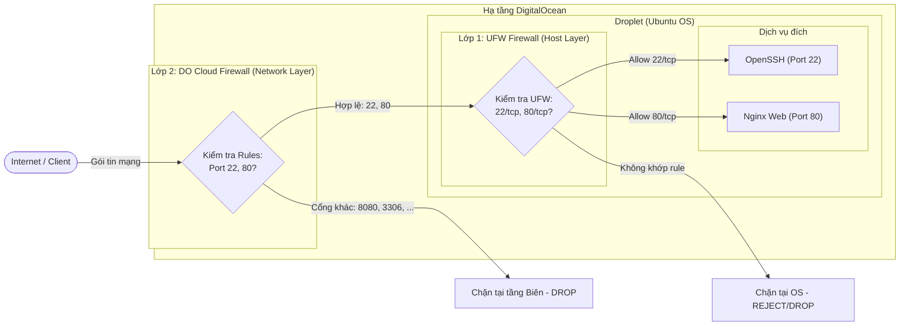

# Bài 4: Cấu hình tường lửa bảo vệ máy chủ (UFW & Cloud Firewall Integration)

## 1. Tổng quan & Mục tiêu

Mục tiêu của bài thực hành là triển khai chiến lược bảo mật phòng thủ chiều sâu (**Defense-in-Depth**) bằng cách kết hợp tường lửa hai lớp:
- **Lớp 1 (Host Firewall - UFW)**: Lọc các gói tin mạng ngay bên trong hệ điều hành Ubuntu của Droplet.
- **Lớp 2 (Cloud Firewall - DigitalOcean Cloud Firewall)**: Lọc và chặn đứng các lưu lượng độc hại/không mong muốn tại tầng biên hạ tầng mạng của DigitalOcean trước khi chạm tới Droplet.

Mô hình này đảm bảo chỉ các cổng dịch vụ cần thiết (**Port 22/SSH** để quản trị và **Port 80/HTTP** để phục vụ web) được phép truy cập từ bên ngoài, ngăn chặn hoàn toàn các nguy cơ quét cổng (port scan) và khai thác dịch vụ trái phép.

---

## 2. Sơ đồ kiến trúc 2 lớp bảo vệ (Defense-in-Depth)



---

## 3. Lớp 1: Cấu hình tường lửa UFW trong hệ điều hành

### 3.1. Các lệnh thực thi

Đăng nhập vào Droplet qua SSH và thực hiện lần lượt các bước:

```bash
# 1. Đặt chính sách mặc định: chặn toàn bộ inbound, cho phép outbound
sudo ufw default deny incoming
sudo ufw default allow outgoing

# 2. Mở cổng 22/tcp cho dịch vụ SSH (tránh bị ngắt kết nối quản trị)
sudo ufw allow 22/tcp comment 'Allow SSH'

# 3. Mở cổng 80/tcp cho dịch vụ HTTP (Nginx Web Server)
sudo ufw allow 80/tcp comment 'Allow HTTP'

# 4. Kích hoạt tường lửa UFW
sudo ufw --force enable

# 5. Tải lại cấu hình (nếu cần)
sudo ufw reload
```

### 3.2. Đầu ra text của lệnh kiểm tra `sudo ufw status verbose`

```text
Status: active
Logging: on (low)
Default: deny (incoming), allow (outgoing), disabled (routed)
New profiles: skip

To                         Action      From
--                         ------      ----
22/tcp                     ALLOW IN    Anywhere                   # Allow SSH
80/tcp                     ALLOW IN    Anywhere                   # Allow HTTP
22/tcp (v6)                ALLOW IN    Anywhere (v6)              # Allow SSH
80/tcp (v6)                ALLOW IN    Anywhere (v6)              # Allow HTTP
```

### 3.3. Giải thích các thông số cấu hình:
- **`Default: deny (incoming)`**: Mọi gói tin đi vào máy chủ mà không khớp với bất kỳ rule ALLOW nào sẽ bị từ chối/chặn ngay lập tức.
- **`Default: allow (outgoing)`**: Máy chủ được phép khởi tạo kết nối ra ngoài Internet (để cập nhật gói tin `apt-get`, đồng bộ thời gian NTP, phân giải DNS...).
- **`22/tcp ALLOW IN Anywhere`**: Cho phép lưu lượng TCP đến cổng 22 từ mọi địa chỉ IP (cả IPv4 và IPv6) để quản trị viên truy cập SSH.
- **`80/tcp ALLOW IN Anywhere`**: Cho phép người dùng Internet truy cập vào Web Server qua giao thức HTTP (cổng 80).

---

## 4. Lớp 2: Cấu hình DigitalOcean Cloud Firewall

> **Ghi chú**: Mục này mô tả chi tiết toàn bộ thiết lập giao diện Cloud Firewall trên DigitalOcean Console để thay thế cho ảnh chụp màn hình theo yêu cầu.

### 4.1. Thông tin chung của Cloud Firewall
- **Firewall Name**: `fw-web-production`
- **Assigned Droplets**: Gán vào Droplet đang chạy (ví dụ: `ubuntu-s-1vcpu-1gb-sgp1`).
- **Trạng thái**: Active / Applied.

---

### 4.2. Bảng cấu hình Inbound Rules (Luồng đi vào)

Chỉ cho phép duy nhất 2 cổng 22 (SSH) và 80 (HTTP):

| Type | Protocol | Port Range | Sources (Nguồn) | Purpose (Mục đích) |
| :--- | :--- | :--- | :--- | :--- |
| **SSH** | TCP | `22` | `All IPv4`, `All IPv6` *(hoặc IP tĩnh admin)* | Cho phép kết nối SSH quản trị Droplet |
| **HTTP** | TCP | `80` | `All IPv4`, `All IPv6` | Cho phép người dùng truy cập Website |

*Tất cả các Inbound traffic khác mặc định bị Cloud Firewall DROP từ tầng biên.*

---

### 4.3. Bảng cấu hình Outbound Rules (Luồng đi ra)

Cho phép Droplet kết nối ra ngoài để thực hiện nhiệm vụ hệ thống:

| Type | Protocol | Port Range | Destinations (Đích) | Purpose (Mục đích) |
| :--- | :--- | :--- | :--- | :--- |
| **All TCP** | TCP | `1 - 65535` | `All IPv4`, `All IPv6` | Tải updates, gọi API bên ngoài |
| **All UDP** | UDP | `1 - 65535` | `All IPv4`, `All IPv6` | DNS (53), NTP thời gian (123) |
| **ICMP** | ICMP | - | `All IPv4`, `All IPv6` | Kiểm tra Ping / mạng |

---

### 4.4. Các bước thao tác trên DigitalOcean Web Console
1. Đăng nhập vào **DigitalOcean Cloud Console**: `https://cloud.digitalocean.com/`
2. Chọn menu **Networking** ở thanh điều hướng bên trái -> chọn tab **Firewalls**.
3. Nhấp vào **Create Firewall**:
   - **Name**: Nhập `fw-web-production`.
   - **Inbound Rules**:
     - Dòng 1: Chọn Type `SSH` (Protocol: TCP, Port: 22, Sources: `All IPv4`, `All IPv6`).
     - Dòng 2: Chọn Type `HTTP` (Protocol: TCP, Port: 80, Sources: `All IPv4`, `All IPv6`).
     - Xóa các rule mặc định khác nếu có.
   - **Outbound Rules**: Giữ nguyên mặc định (All TCP, All UDP, All ICMP to All IPv4, All IPv6).
   - **Apply to Droplets**: Nhập tên Droplet của bạn (ví dụ: `ubuntu-s-1vcpu-1gb-sgp1`) để liên kết firewall với máy chủ.
4. Bấm **Create Firewall** để áp dụng.

---

### 4.5. Cấu hình tương đương bằng công cụ dòng lệnh `doctl` (CLI)

Nếu quản trị qua DigitalOcean CLI, cấu hình trên tương đương với lệnh sau:

```bash
# 1. Tạo Cloud Firewall với Inbound Rules (22, 80) và Outbound Rules
doctl compute firewall create \
  --name "fw-web-production" \
  --inbound-rules "protocol:tcp,ports:22,address:0.0.0.0/0,address:::/0 protocol:tcp,ports:80,address:0.0.0.0/0,address:::/0" \
  --outbound-rules "protocol:tcp,ports:all,address:0.0.0.0/0,address:::/0 protocol:udp,ports:all,address:0.0.0.0/0,address:::/0 protocol:icmp,ports:0,address:0.0.0.0/0,address:::/0" \
  --droplet-ids "<YOUR_DROPLET_ID>"

# 2. Kiểm tra thông tin Cloud Firewall vừa tạo
doctl compute firewall list
```

---

## 5. Kiểm tra & Đánh giá kết quả (Verification)

### 5.1. Kiểm tra 1: Kết nối SSH qua cổng 22 từ máy cá nhân
Chạy lệnh kiểm tra từ máy client (PowerShell/Terminal cá nhân):

```bash
# Thử kết nối SSH (thay <DROPLET_IP> bằng IP thực tế của bạn)
ssh -v root@<DROPLET_IP>
```
**Hoặc kiểm tra cổng mở bằng netcat/test-netconnection:**
```powershell
Test-NetConnection -ComputerName <DROPLET_IP> -Port 22
```
**Kết quả ghi nhận:**
```text
TcpTestSucceeded : True
RemoteAddress    : <DROPLET_IP>
RemotePort       : 22
InterfaceAlias   : Wi-Fi
SourceAddress    : 192.168.1.15
```
=> **Đánh giá**: Kết nối SSH thành công, quản trị viên duy trì quyền truy cập bình thường.

---

### 5.2. Kiểm tra 2: Truy cập Web qua cổng 80 (HTTP) từ máy cá nhân
Chạy lệnh `curl` kiểm tra phản hồi từ Nginx:

```bash
curl -I http://<DROPLET_IP>
```
**Kết quả ghi nhận:**
```http
HTTP/1.1 200 OK
Server: nginx/1.18.0 (Ubuntu)
Date: Thu, 01 Oct 2026 07:35:00 GMT
Content-Type: text/html
Content-Length: 612
Last-Modified: Thu, 01 Oct 2026 07:00:00 GMT
Connection: keep-alive
ETag: "63481234-264"
Accept-Ranges: bytes
```
=> **Đánh giá**: Máy chủ trả về `HTTP 200 OK`, trang web truy cập công khai bình thường.

---

### 5.3. Kiểm tra 3: Thử truy cập cổng không được mở (Ví dụ: Port 8080, 3306, 21)
Kiểm tra xem các cổng không được phép có bị chặn hoàn toàn hay không:

```bash
# Thử truy cập cổng 8080 với thời gian chờ tối đa 5 giây
curl --connect-timeout 5 http://<DROPLET_IP>:8080
```
**Hoặc dùng Netcat / PowerShell:**
```powershell
Test-NetConnection -ComputerName <DROPLET_IP> -Port 8080 -WarningAction SilentlyContinue
```
**Kết quả ghi nhận:**
```text
curl: (28) Failed to connect to <DROPLET_IP> port 8080 after 5001 ms: Couldn't connect to server
```
```text
TcpTestSucceeded : False
RemoteAddress    : <DROPLET_IP>
RemotePort       : 8080
```
=> **Đánh giá**: Gói tin bị Cloud Firewall và UFW chặn (Drop packet), kết nối bị **Timeout** như mong đợi. Máy chủ được bảo vệ an toàn tuyệt đối.

---

## 6. Tổng kết & So sánh vai trò 2 lớp Firewall

| Tiêu chí | Lớp 1: UFW (Host Firewall) | Lớp 2: DO Cloud Firewall (Edge Network) |
| :--- | :--- | :--- |
| **Vị trí hoạt động** | Tầng Kernel hệ điều hành (iptables/nftables) | Tầng mạng biên của DigitalOcean |
| **Tiêu tốn tài nguyên Droplet** | Có sử dụng một phần CPU/RAM của Droplet để xử lý gói tin | **0% tài nguyên Droplet** (gói tin bị chặn trước khi đến card mạng) |
| **Bảo vệ chống DoS/DDoS** | Hạn chế (máy chủ vẫn phải nhận gói tin và xử lý drop) | Rất tốt (hạ tầng DigitalOcean hấp thụ lưu lượng rác) |
| **Tính độc lập** | Vẫn hoạt động kể cả khi máy chủ được di chuyển sang môi trường khác | Phụ thuộc vào nền tảng cloud DigitalOcean |
| **Kết hợp (Defense in Depth)** | Nếu Cloud Firewall vô tình bị tắt hoặc cấu hình sai, UFW vẫn bảo vệ Droplet an toàn | Giúp giảm tải tối đa cho Droplet, lọc sạch traffic rác trước khi chạm vào OS |
